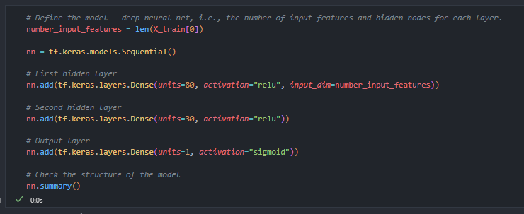

# Deep Learning Challenge

## Description

The nonprofit foundation Alphabet Soup wants a tool that can help it select the applicants for funding with the best chance of success in their ventures. With your knowledge of machine learning and neural networks, you’ll use the features in the provided dataset to create a binary classifier that can predict whether applicants will be successful if funded by Alphabet Soup. From Alphabet Soup’s business team, you have received a CSV containing more than 34,000 organizations that have received funding from Alphabet Soup over the years. 

## Getting Started

#### The instructions for this Challenge are divided into the following subsections:

* Step 1: Preprocess the Data
* Step 2: Compile, Train, and Evaluate the Model
* Step 3: Optimize the Model
* Step 4: Write a Report on the Neural Network Model
* Step 5: Copy Files Into Your Repository

## Setup

* scikit-learn 1.0.2
* tensorflow 2.11.0
* pandas 1.0.5
* python 3.7.7

## Dependencies

* from sklearn.model_selection import train_test_split
* from sklearn.preprocessing import StandardScaler
* import pandas as pd
* import tensorflow as tf

## Grading

* Preprocess the Data (30 points)
* Compile, Train and Evaluate the Model (20 points)
* Optimize the Model (20 points)
* Write a Report on the Neural Network Model (30 points)

# REPORT

## Explain the purpose of the analysis

The purpose is to create a model that can predict, based on available data (features), if an applicant will be successful if funded by Alphabet Soup.

## Answer all 6 questions in the results section

### What variable(s) are the target(s) for your model?
* The variable IS_SUCCESSFUL is the target for my model.

### What variable(s) are the features for your model?
* The feature variables are APPLICATION_TYPE, AFFILIATION, CLASSIFICATION, USE_CASE, ORGANIZATION, STATUS, INCOME_AMT, SPECIAL_CONSIDERATIONS AND ASK_AMT.

### What variable(s) should be removed from the input data because they are neither targets nor features?
* The variables I removed are EIN and NAME.

### How many neurons, layers, and activation functions did you select for your neural network model, and why?

Model 1

Optimization 1

Optimization 2

Optimization 3

### Were you able to achieve the target model performance?

Model 1

Optimization 1

Optimization 2

Optimization 3

*

### What steps did you take in your attempts to increase model performance?
*

## Summarize the overall results of your model

## Describe how you could use a different model to solve the same problem, and explain why you would use that model

## Authors

Danik Lafrance https://github.com/daniklafrance

## References

IRS. Tax Exempt Organization Search Bulk Data Downloads. https://www.irs.gov/Links to an external site.