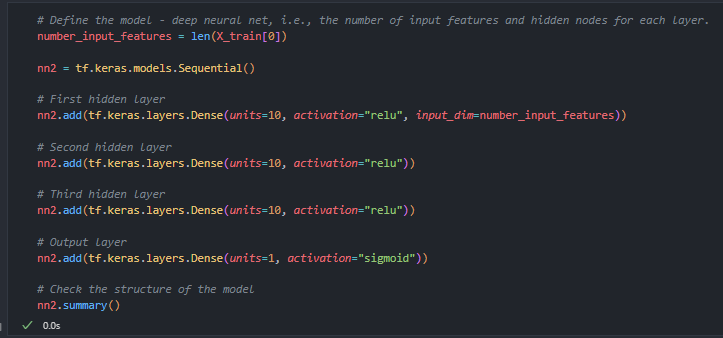
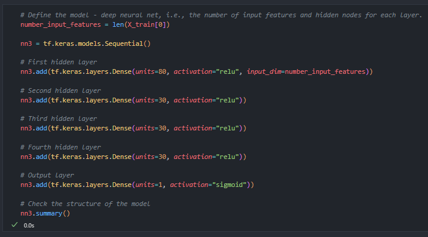

# REPORT

## Explain the purpose of the analysis

The purpose is to create a model that can predict, based on available data (features), if an applicant will be successful if funded by Alphabet Soup.

## Answer all 6 questions in the results section:

### What variable(s) are the target(s) for your model?
* The variable IS_SUCCESSFUL is the target for my model.

### What variable(s) are the features for your model?
* The feature variables are APPLICATION_TYPE, AFFILIATION, CLASSIFICATION, USE_CASE, ORGANIZATION, STATUS, INCOME_AMT, SPECIAL_CONSIDERATIONS AND ASK_AMT.

### What variable(s) should be removed from the input data because they are neither targets nor features?
* The variables I removed are EIN and NAME.

### How many neurons, layers, and activation functions did you select for your neural network model, and why?

##### Model 1

##### Optimization 1

##### Optimization 2

##### Optimization 3

* In model 1, I started off with the shown example and then built upon that for the optimization models. I tried to vary the changes to see how the performance would be impacted. Below is how each model performed.

### Were you able to achieve the target model performance?

##### Model 1

##### Optimization 1

##### Optimization 2

##### Optimization 3

* I was not able to achieve the target of 75% accuracy. 

### What steps did you take in your attempts to increase model performance?
* Simply put, I made adjustements to the model in the order of my coding. I started adjusting the data to see what the impact would be. Then I moved on to the layers and neurons of the model. Finally, I made adjustments to the epochs.

## Summarize the overall results of your model
* I was not able to increase performance of the original model. Accuracy ended up being 0.7252, 0.7241, 0.7236 and 0.7233 respectively. 

## Describe how you could use a different model to solve the same problem, and explain why you would use that model
* My next step would be to run the KERAS TUNER model on the data to find the optimal settings.